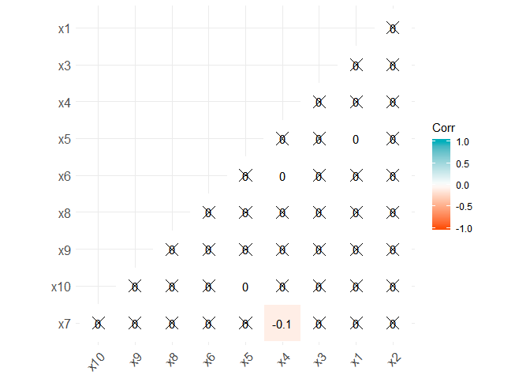
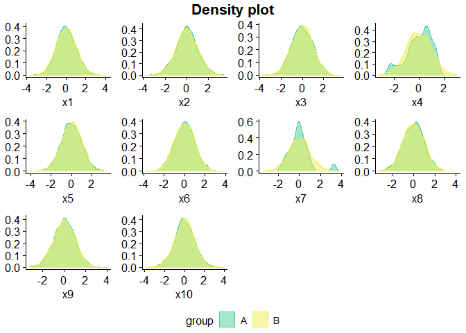
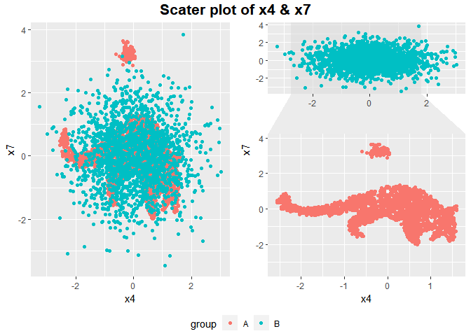

Ex-numbat
================
IMSOHYUN
2019년 4월 26일

Load Data
---------

``` r
library(readr)
library(tidyverse)
```

    ## -- Attaching packages --------------------------- tidyverse 1.2.1 --

    ## √ ggplot2 3.1.0     √ purrr   0.2.5
    ## √ tibble  1.4.2     √ dplyr   0.7.8
    ## √ tidyr   0.8.2     √ stringr 1.3.1
    ## √ ggplot2 3.1.0     √ forcats 0.3.0

    ## -- Conflicts ------------------------------ tidyverse_conflicts() --
    ## x dplyr::filter() masks stats::filter()
    ## x dplyr::lag()    masks stats::lag()

``` r
library(ggthemes)
library(ggpubr)
```

    ## Loading required package: magrittr

    ## 
    ## Attaching package: 'magrittr'

    ## The following object is masked from 'package:purrr':
    ## 
    ##     set_names

    ## The following object is masked from 'package:tidyr':
    ## 
    ##     extract

``` r
setwd("C:/Users/user/Desktop/I/ewha2/Graphics")
numbat <- read_csv("numbat.csv") # dim (4000,11)
```

    ## Parsed with column specification:
    ## cols(
    ##   x1 = col_double(),
    ##   x2 = col_double(),
    ##   x3 = col_double(),
    ##   x4 = col_double(),
    ##   x5 = col_double(),
    ##   x6 = col_double(),
    ##   x7 = col_double(),
    ##   x8 = col_double(),
    ##   x9 = col_double(),
    ##   x10 = col_double(),
    ##   group = col_character()
    ## )

``` r
attach(numbat)
names(numbat)
```

    ##  [1] "x1"    "x2"    "x3"    "x4"    "x5"    "x6"    "x7"    "x8"   
    ##  [9] "x9"    "x10"   "group"

``` r
table(numbat$group)
```

    ## 
    ##    A    B 
    ## 2100 1900

corrplot
--------

``` r
library("ggcorrplot")
x_var <- numbat[,-11]
corr <- round(cor(x_var), 1)
ggcorrplot(corr, p.mat = cor_pmat(x_var),
           hc.order = TRUE, type = "lower",
           color = c("#FC4E07", "white", "#00AFBB"),
           outline.col = "white", lab = TRUE)
```



density plot
------------

``` r
my.den <- function(var){
  ggdensity(numbat, x = var, fill = "group", color ="group",
            palette = c("#4ccd97", "#f0ed51"),ylab=FALSE)
}

figure <- ggarrange(my.den("x1"),my.den("x2"),my.den("x3"),my.den("x4"),
                    my.den("x5"),my.den("x6"),my.den("x7"),my.den("x8"),
                    my.den("x9"),my.den("x10"),
                    common.legend = TRUE, legend="bottom",
                    ncol=4,nrow=3)

annotate_figure(figure,
                top = text_grob("Density plot",face = "bold", size = 16)  )
```



scatter plot
------------

``` r
s1 <- ggplot(numbat) + geom_point(aes(x4,x7,col=group))  

library(ggforce)
s2 <- ggplot(numbat, aes(x4,x7, colour = group)) +
  geom_point() + facet_zoom(x = group == "A", zoom.data = group == "A")
s <- ggarrange(s1,s2,ncol=2,common.legend = TRUE,legend="bottom")
annotate_figure(s, top = text_grob("Scater plot of x4 & x7",face = "bold", size = 16))
```




